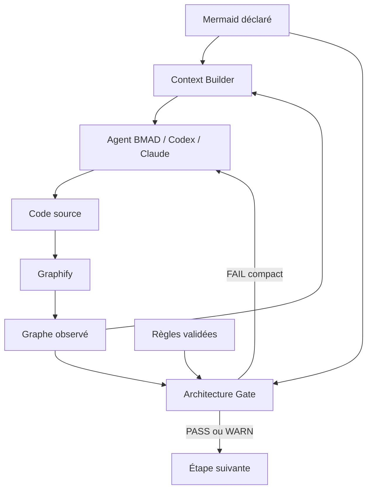

# Architecture Harness V2.2

Architecture Harness donne à BMAD, Codex, Claude ou tout autre agent une ligne directrice architecturale compacte issue de Mermaid, puis vérifie déterministement le code réellement produit. Mermaid guide l’agent ; seules les règles explicitement validées par un humain peuvent bloquer.

Le logiciel ne génère pas lui-même le code et ne remplace ni Graphify, ni les tests métier, ni la revue. Il fournit le module architectural pluggable entre l’orchestrateur et ces outils.

## Le principe



Trois notions restent séparées :

- l’architecture **déclarée** dans `architecture/diagrams/*.mmd` et `contexte/*.mmd` ;
- l’architecture **observée** par Graphify dans `graphify-out/graph.json` ;
- la politique **validée** dans `architecture/rules/rules.yaml`.

Une flèche Mermaid est une direction de conception, jamais automatiquement une obligation. Le Rule Authoring Skill demande les précisions nécessaires et écrit d’abord une candidate non bloquante.

## Pourquoi ce n’est pas ArchUnit

Architecture Harness agit au niveau macro, indépendamment du langage et de l’orchestrateur. Il combine Mermaid, graphe observé et règles pour guider l’agent avant le code et le corriger après un checkpoint. ArchUnit est un validateur Java natif, excellent pour des invariants de packages/classes dans les tests.

Les deux sont complémentaires : le skill externe `integrations/archunit/` peut traduire une règle déjà validée en test ArchUnit candidat. Le core Python n’importe jamais ArchUnit et ne valide jamais automatiquement le test généré.

## Provenance et confiance

V2 distingue l’origine d’une preuve de la confiance de l’extracteur :

| Origine | Sens |
|---|---|
| `DECLARED` | fait présent dans Mermaid |
| `OBSERVED` | fait extrait du code |
| `INFERRED` | relation déduite, non promue automatiquement |
| `USER_CONFIRMED` | décision explicitement confirmée |
| `GENERATED` | proposition produite par un outil/agent |
| `AMBIGUOUS` | information trop incertaine pour bloquer |

Graphify conserve parallèlement sa confiance native (`EXTRACTED`, `INFERRED`, `AMBIGUOUS`). Une inférence LLM ou Graphify ne devient jamais silencieusement une règle validée.

## Règles et lifecycle

Types supportés : `required_edge`, `forbidden_edge`, `required_path`, `forbidden_path`. Le Rule IR conserve aussi `allowed_targets`, `severity`, `scope`, `exceptions`, `rationale`, `provenance` et `status`.

```text
proposed → clarification → candidate → review → validated
```

Seule une violation d’une règle `severity: error` et `status: validated` produit un FAIL. Une candidate ou un warning apparaît comme `WARN`/advisory. Les candidates vivent dans `architecture/rules/candidates.yaml`; les promotions humaines sont tracées dans `architecture/rules/decisions.md`.

L’applicabilité distingue une absence normale d’un mapping cassé : `when_observed` retourne `NOT_APPLICABLE` tant que le composant n’existe pas, `required` retourne `UNRESOLVED` si une règle validée ne peut pas résoudre sa source ou sa cible, et `declared_only` reste une ligne directrice non évaluée. Le Harness ne présente donc plus « rien à vérifier » comme un PASS.

Exemple :

```yaml
- id: controller-must-not-call-repository
  type: forbidden_edge
  source: Controller
  target: Repository
  severity: error
  scope: [src]
  exceptions: []
  rationale: Controllers delegate through services.
  provenance: USER_CONFIRMED
  status: validated
  applicability: required
```

Le skill `skills/architecture-rule-author/` est installé dans l’orchestrateur. Il reçoit automatiquement le Mermaid validé par le parser officiel, les faits normalisés et des mappings Graphify classés via `arch-harness rules author-context --format json`. Il résout les correspondances étayées, ne pose de questions que pour les ambiguïtés restantes, écrit les candidates, puis s’arrête avant promotion sans approbation explicite.

## Installation

Prérequis : Python 3.10+, Node.js 20+ et npm.

```bash
python3 -m venv .venv
.venv/bin/python -m pip install -e '.[dev]'
npm ci
.venv/bin/arch-harness doctor
```

Graphify 0.9.50 est la source de l’architecture observée. Le harnais ne réimplémente pas son analyse.

Mermaid 11.17.2 est la source officielle du parsing déclaré. Le runtime Node remplace l’ancien parseur Python regex, valide les familles Mermaid avec Mermaid lui-même et normalise leurs faits structurels. Le texte officiel validé reste fourni au Rule Author pour les diagrammes qui ne représentent pas un graphe de dépendances uniforme.

## API universelle

```bash
arch-harness graph refresh --format json
arch-harness agent context --focus <node> --format json
arch-harness agent validate --format json
arch-harness gate --format json
arch-harness capabilities --format json
arch-harness rules author-context --format json
arch-harness doctor
```

Codes de sortie :

| Code | Sens | Action |
|---:|---|---|
| 0 | PASS ou WARN non bloquant | continuer et conserver les advisories |
| 1 | violation `error + validated` | corriger le code, refresh, relancer le gate |
| 2 | erreur technique/configuration | lancer `doctor`, réparer, ne pas contourner |

Un résultat `UNRESOLVED` utilise le code 2 : une règle validée marquée `required` n’a pas trouvé sa source ou sa cible et ne peut donc pas prétendre avoir contrôlé l’architecture. `NOT_APPLICABLE` utilise le code 0 pour un composant futur, optionnel ou purement déclaré.

Le gate est en lecture seule : il ne modifie jamais le code, ne rafraîchit pas implicitement le graphe et refuse un graphe périmé.

## Workflow quotidien

### 1. Avant une modification significative

Identifier un nœud Graphify pertinent :

```bash
arch-harness agent context --focus PaymentService --format json
```

La réponse borne le voisinage, projette Mermaid et les règles applicables, donne les fichiers utiles et conserve provenance, sévérité, statut et rationale. L’agent ne charge pas tout le graphe.

### 2. Implémenter et tester

L’agent modifie le code et exécute les tests fonctionnels. Un PASS architectural ne prouve pas que le logiciel fonctionne : le run réel V2 a justement produit une première correction gate-PASS mais runtime-FAIL.

### 3. Checkpoint significatif

```bash
arch-harness graph refresh --format json
arch-harness gate --format json
```

Ne pas lancer le gate après chaque fichier. L’utiliser après une étape cohérente, une story, avant revue et avant de déclarer terminé.

### 4. En cas de FAIL

Le rapport fournit règle, sévérité, source/cible, plus court chemin, fichiers, provenance, rationale et architecture attendue. Réinjecter uniquement ce rapport compact dans l’agent, corriger le code, puis répéter refresh/gate. Ne jamais affaiblir une règle pour obtenir PASS ; une règle obsolète exige une décision humaine.

## Workflow BMAD

BMAD 6.11 est le consommateur officiel principal, sans dépendance dans le core.

```bash
npx bmad-method install --modules bmm --tools codex
arch-harness --root /path/to/project integrations install bmad \
  --adapter-root /path/to/architecture-harness
```

BMAD 6.11 requiert `uv` pour rendre `bmad-build`. L’adapter installe trois overrides d’équipe officiels dans `_bmad/custom/` et le skill appelable dans `.agents/skills/architecture-rule-author/` :

- `bmad-architecture` confronte brownfield observé et Mermaid, puis déclenche l’authoring candidat ;
- `bmad-build` demande le contexte compact, impose les checkpoints et boucle sur les FAIL ;
- `bmad-code-review` charge le dernier verdict sans remplacer la revue.

`bmad-architecture` invoque automatiquement le Rule Author après un changement Mermaid. `bmad-build` le réinvoque après le premier graphe greenfield ou un mapping non résolu afin de rapprocher Mermaid et Graphify sans demander d’identifiants manuels.

Séquence recommandée :

```text
bmad-architecture
→ Mermaid
→ Rule Authoring Skill
→ clarification
→ candidates
→ validation humaine
→ rules validated
→ bmad-build
→ context compact
→ code + tests
→ Graphify refresh
→ gate
→ correction jusqu’à PASS
→ bmad-code-review
```

BMAD conserve ses checkpoints humains. L’essai E2E a été poursuivi après approbation explicite : implémentation, tests runtime, Graphify, gate PASS, trois couches de revue, correction d’un manque de vérification et revalidation finale ont abouti. Le commit local et l’ouverture VS Code ont seuls échoué dans l’environnement temporaire.

## Greenfield et brownfield

- Greenfield : partir de Mermaid/règles candidates, écrire du code significatif, puis créer le premier graphe et lancer le premier gate.
- Brownfield : exécuter Graphify avant le développement pour obtenir une baseline, puis comparer observé, déclaré et règles validées.

## Adapters

- BMAD : `integrations/bmad/`
- Codex : `integrations/codex/AGENTS.snippet.md`
- Claude : `integrations/claude/SKILL.md`
- générique : `integrations/generic/README.md`
- ArchUnit optionnel : `integrations/archunit/SKILL.md`

Tous appellent la même CLI. `arch-harness capabilities --format json` suffit à un consommateur générique pour découvrir le contrat.

Les installateurs `integrations install codex` et `integrations install claude` déploient le même Rule Author ainsi que les instructions de déclenchement du projet.

Documentation détaillée :

- concepts, répertoires, règles et Rule Author Skill : [`documentation/DOCUMENTATION_FONCTIONNELLE.md`](documentation/DOCUMENTATION_FONCTIONNELLE.md) ;
- couches internes, interactions et référence complète des commandes : [`documentation/DOCUMENTATION_TECHNIQUE.md`](documentation/DOCUMENTATION_TECHNIQUE.md) ;
- installation pas à pas avec Claude Code, BMAD, Codex et GitHub Copilot : [`documentation/INSTALLATION_ORCHESTRATEURS.md`](documentation/INSTALLATION_ORCHESTRATEURS.md).

## Validation

```bash
scripts/validate_v2.sh
```

La validation rafraîchit Graphify, contrôle la fraîcheur et la configuration, exécute pytest, le gate, les capacités, le benchmark V2, le Test Lab A–L, les validateurs de skills et le parsing des overrides BMAD.

Résultats V2 observés avant le gate final :

- 68 tests passants ;
- Test Lab déterministe : 12 scénarios, 4/4 violations connues détectées, 0 faux blocage dans le corpus ;
- benchmark C vs B : 48,7 % de réduction de contexte sur cinq tâches ;
- correction Codex réelle : réussite finale en deux processus, avec un échec fonctionnel intermédiaire conservé ;
- BMAD réel : workflow post-approbation complet jusqu’à l’implémentation revue et au gate final PASS.

Ces chiffres ne sont pas généralisés au-delà des corpus exécutés. Les métriques indisponibles restent `NOT_MEASURED`.

## Architecture interne

```text
src/architecture_harness/
├── adapters/       Graphify, Mermaid, règles
├── ir/             graphes, règles, provenance
├── engine/         matching, chemins, contexte, gate
├── exporters/      JSON, texte, Markdown
├── metrics/        tokens et benchmark A/B/C
├── ace/            expérimentation optionnelle
├── integrations.py installation des adapters
├── graphify_runtime.py
├── graph_freshness.py
├── doctor.py
└── cli.py
```

## Limites connues

- Les matchers de rôles restent explicites et lexicaux ; leur résolution doit être testée.
- `scope` et `exceptions` sont conservés dans l’IR mais n’ont pas encore de sémantique active universelle.
- Mermaid officiel accepte les familles supportées par Mermaid, mais certaines familles non orientées dépendances ne produisent naturellement aucune arête de politique ; leur texte et leurs faits restent transmis au skill comme guidance déclarée.
- La qualité dépend fortement de la précision edge/path des règles.
- Le Test Lab est déterministe ; il ne remplace pas les runs agentiques.
- Une seule correction Codex réelle ne donne pas un taux de succès généralisable.
- Claude et ArchUnit n’ont pas été exécutés réellement dans ce repository.
- Un seul petit E2E BMAD a été terminé ; son coût élevé et son comportement ne sont pas encore représentatifs de projets réels.

## Traçabilité

- évaluation finale : `experiments/results/V2_FINAL_EVALUATION.md`
- baseline : `experiments/results/V2_BASELINE.md`
- benchmark : `experiments/results/V2_ABC_BENCHMARK.md`
- Test Lab : `experiments/agent-runs/V2_TEST_LAB_RESULTS.json`
- runs réels : `experiments/agent-runs/`
- journaux : `logs/V2_*.md`
- baseline V1 : tag Git `v1.0.0`
