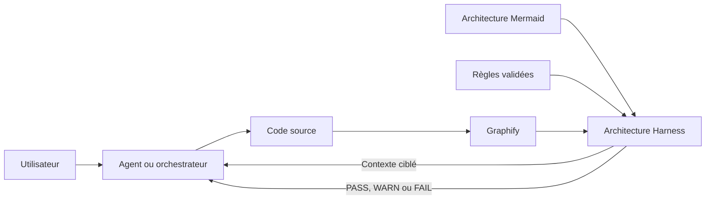
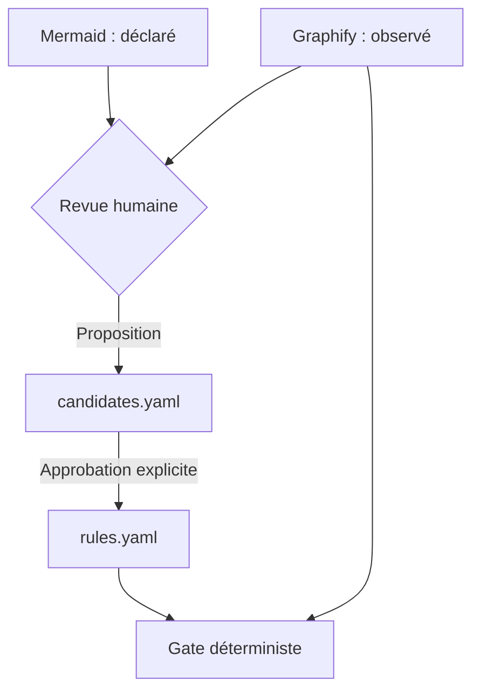
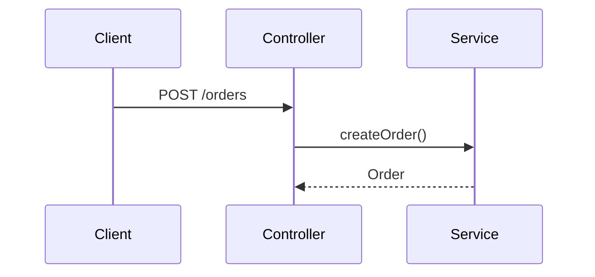
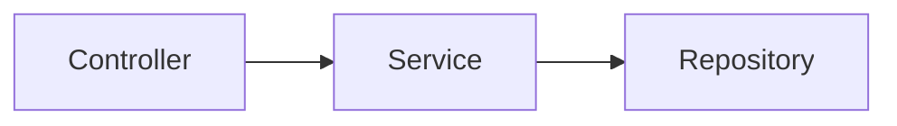
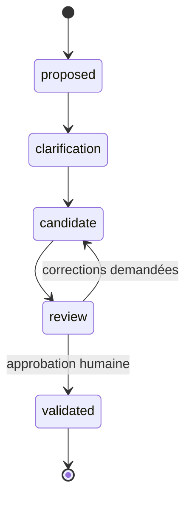
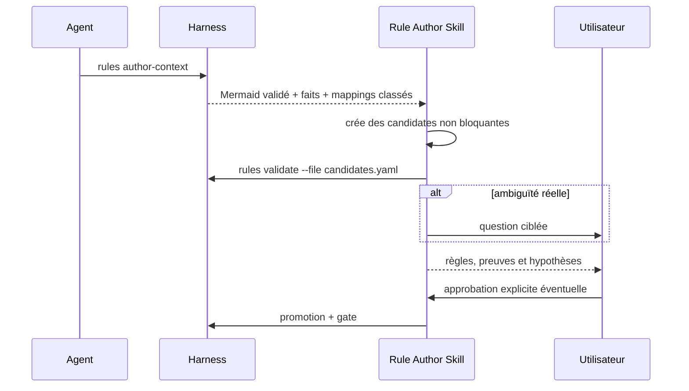
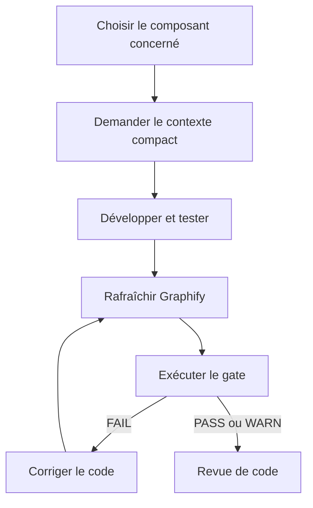

# Documentation fonctionnelle

Ce guide explique Architecture Harness sans supposer de connaissance préalable. Il présente le problème résolu, les concepts, les répertoires attendus, le cycle de vie des règles et le skill qui aide à les rédiger. Pour les détails d’implémentation, consultez [DOCUMENTATION_TECHNIQUE.md](DOCUMENTATION_TECHNIQUE.md). Pour installer le produit, consultez [INSTALLATION_ORCHESTRATEURS.md](INSTALLATION_ORCHESTRATEURS.md).

## 1. À quoi sert Architecture Harness ?

Un agent de développement sait écrire du code, mais il peut ignorer une contrainte d’architecture : appeler directement une base depuis un contrôleur, contourner une couche métier ou introduire une dépendance interdite.

Architecture Harness ajoute deux garde-fous :

1. avant le développement, il donne à l’agent un contexte architectural court et ciblé ;
2. après une étape significative, il compare le code observé aux règles validées et produit un verdict déterministe.

Le Harness ne génère pas le code, ne remplace pas les tests et ne décide pas seul des règles de l’équipe.



## 2. Les trois sources de vérité

Le logiciel sépare volontairement trois informations qui ne doivent jamais être confondues.

| Source | Emplacement | Question à laquelle elle répond |
|---|---|---|
| Architecture déclarée | `architecture/diagrams/*.mmd` et `contexte/*.mmd` | « Comment voulons-nous organiser le système ? » |
| Architecture observée | `graphify-out/graph.json` | « Quelles dépendances existent réellement dans le code ? » |
| Politique validée | `architecture/rules/rules.yaml` | « Quelles contraintes ont été approuvées et peuvent bloquer ? » |

Une flèche Mermaid exprime une intention de conception. Elle ne devient pas automatiquement une règle obligatoire. Cette séparation empêche une interprétation de l’agent de devenir silencieusement une politique bloquante.



## 3. Les répertoires d’un projet

Après configuration, un projet consommateur ressemble à ceci :

```text
mon-projet/
├── architecture/
│   ├── diagrams/
│   │   └── target.mmd
│   └── rules/
│       ├── candidates.yaml
│       ├── decisions.md
│       └── rules.yaml
├── contexte/
│   ├── runtime.mmd
│   ├── security.mmd
│   └── deployment.mmd
├── graphify-out/
│   ├── graph.json
│   └── manifest.json
└── src/
```

### `architecture/diagrams/`

Contient l’architecture cible en Mermaid : composants, couches, domaines et relations souhaitées. Plusieurs fichiers `.mmd` sont permis.

Exemple `architecture/diagrams/target.mmd` :


### `contexte/`

Contient des diagrammes complémentaires : séquences d’exécution, sécurité, déploiement ou communication entre systèmes. Ces diagrammes guident l’agent, même lorsqu’ils ne correspondent pas directement à une dépendance de code.

Exemple `contexte/runtime.mmd` :



### `architecture/rules/candidates.yaml`

Contient les règles proposées par le skill. Elles sont révisables et non bloquantes. C’est l’espace de travail entre l’intention Mermaid, le code observé et la décision humaine.

### `architecture/rules/rules.yaml`

Contient uniquement les règles validées. Une règle ne bloque que si elle a `status: validated` et `severity: error`.

### `architecture/rules/decisions.md`

Journal lisible par l’équipe : règle approuvée ou rejetée, auteur, date et justification. Il explique pourquoi la politique existe.

### `graphify-out/`

Contient le graphe extrait du code et son manifeste de fraîcheur. Il s’agit d’un artefact généré : on le rafraîchit après une modification significative du code.

## 4. Comprendre une règle

Exemple complet :

```yaml
roles:
  Controller:
    match:
      exact: src_orders_controller_ordercontroller
  Repository:
    match:
      exact: src_orders_repository_orderrepository

rules:
  - id: controller-must-not-call-repository
    type: forbidden_edge
    source: Controller
    target: Repository
    allowed_targets: []
    severity: error
    scope: [src]
    exceptions: []
    rationale: Le contrôleur doit déléguer au service métier.
    provenance: USER_CONFIRMED
    status: validated
    applicability: required
```

Les `roles` relient un nom métier stable, comme `Controller`, à l’identifiant réellement observé par Graphify. La règle exprime ensuite la contrainte entre ces rôles.

### Les quatre types de règles

| Type | Signification | Exemple |
|---|---|---|
| `required_edge` | une dépendance directe doit exister | Controller doit appeler Service |
| `forbidden_edge` | une dépendance directe ne doit pas exister | Controller ne doit pas appeler Repository directement |
| `required_path` | un chemin direct ou indirect doit exister | API doit pouvoir atteindre Audit |
| `forbidden_path` | aucun chemin direct ou indirect ne doit exister | Domain ne doit jamais dépendre d’Infrastructure |

La différence entre `edge` et `path` est importante :



Dans cet exemple, `forbidden_edge Controller → Repository` passe, car il n’existe pas d’appel direct. `forbidden_path Controller → Repository` échoue, car le chemin `Controller → Service → Repository` existe.

### Applicabilité

| Valeur | Comportement si un composant est absent |
|---|---|
| `required` | `UNRESOLVED`, car la règle obligatoire ne peut pas être évaluée |
| `when_observed` | `NOT_APPLICABLE`, utile pour un composant futur ou optionnel |
| `declared_only` | guidance uniquement, jamais évaluée par le gate |

## 5. Cycle de vie d’une règle



Le chemin normal est :

1. un diagramme ou une demande fait apparaître une intention ;
2. le skill prépare une règle dans `candidates.yaml` ;
3. un humain vérifie le sens, les mappings, la sévérité et les exceptions ;
4. après approbation explicite, la règle rejoint `rules.yaml` et la décision est tracée ;
5. le gate peut désormais l’utiliser.

Ne modifiez jamais une règle validée uniquement pour obtenir un PASS. Si l’architecture a changé, faites réviser la politique par un humain.

## 6. Le skill `architecture-rule-author`

Ce skill assiste Codex, Claude ou BMAD pour transformer des diagrammes en règles candidates. Il ne remplace pas la validation humaine.

### Quand est-il utilisé ?

- après la création ou la modification d’un Mermaid ;
- après le premier graphe Graphify d’un projet greenfield ;
- lorsqu’un rôle ne correspond plus clairement à un nœud du code ;
- lorsqu’une équipe veut proposer une nouvelle règle.

### Comment fonctionne-t-il ?



La commande d’entrée du skill est :

```bash
arch-harness rules author-context --format json
```

Elle fournit le texte Mermaid validé par le parseur officiel, les faits normalisés et jusqu’aux meilleurs candidats Graphify pour chaque composant déclaré.

Le skill doit ensuite :

- conserver tous les faits déclarés utiles ;
- vérifier l’identifiant, le fichier et le type de chaque mapping proposé ;
- ne jamais inventer un identifiant Graphify ;
- écrire seulement dans `candidates.yaml` avant approbation ;
- utiliser `provenance: GENERATED` pour une proposition ;
- poser une question uniquement si plusieurs interprétations changent réellement la politique ;
- arrêter le workflow avant toute promotion non approuvée.

### Exemple d’utilisation

Demande à l’agent :

```text
Ajoute PaymentService dans architecture/diagrams/target.mmd et propose les règles
architecturales correspondantes avec le skill architecture-rule-author.
```

Vérification manuelle :

```bash
arch-harness rules validate --file architecture/rules/candidates.yaml
```

Exemple de candidate attendue :

```yaml
roles:
  PaymentService:
    match:
      exact: src_payments_paymentservice
rules:
  - id: payment-service-must-use-provider
    type: required_edge
    source: PaymentService
    target: PaymentProvider
    allowed_targets: []
    severity: warning
    scope: [src/payments]
    exceptions: []
    rationale: Centraliser les appels au fournisseur de paiement.
    provenance: GENERATED
    status: candidate
    applicability: when_observed
```

## 7. Parcours quotidien



Commandes typiques :

```bash
arch-harness agent context --focus OrderService --format json
# développement + tests fonctionnels
arch-harness graph refresh --format json
arch-harness gate --format json
```

Le code de sortie `0` autorise la suite, `1` indique une violation architecturale bloquante et `2` une erreur technique ou de configuration.

## 8. Greenfield et brownfield

### Nouveau projet (greenfield)

Commencez par Mermaid et des candidates `when_observed`. Après l’apparition du premier code, rafraîchissez Graphify puis relancez le Rule Author pour remplacer les mappings provisoires par des identifiants observés.

### Projet existant (brownfield)

Commencez par `graph refresh` pour obtenir la réalité du code. Le diagramme cible et les premières règles doivent ensuite tenir compte de cette baseline, sans présenter l’existant comme automatiquement souhaitable.

## 9. Lire un verdict

| Statut | Sens | Action |
|---|---|---|
| `PASS` | toutes les règles évaluables sont respectées | poursuivre tests et revue |
| `WARN` | advisory non bloquant | examiner avant de continuer |
| `FAIL` | au moins une règle validée `error` est violée | corriger le code et relancer |
| `NOT_APPLICABLE` | composant optionnel ou futur absent | aucune correction immédiate |
| `UNRESOLVED` | mapping obligatoire introuvable | réparer la règle ou le mapping avec une décision humaine |

Un PASS architectural ne prouve pas que le comportement métier est correct. Les tests fonctionnels, la sécurité et la revue restent indispensables.
