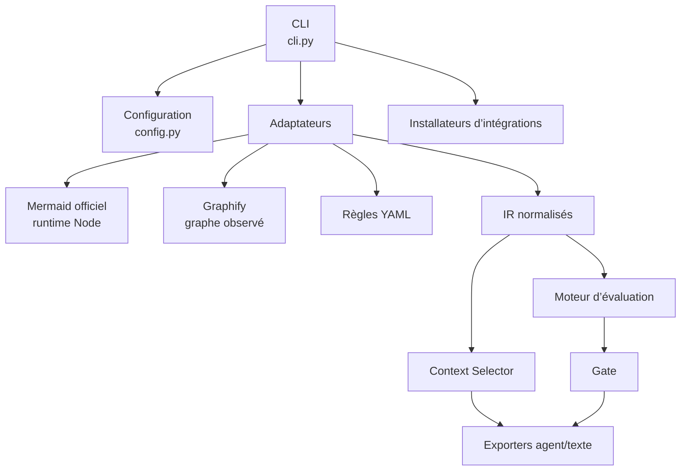
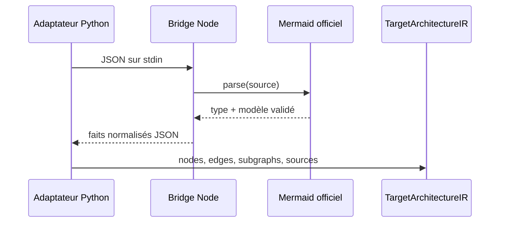
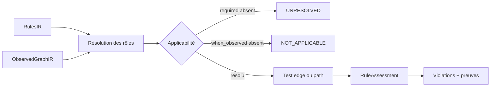
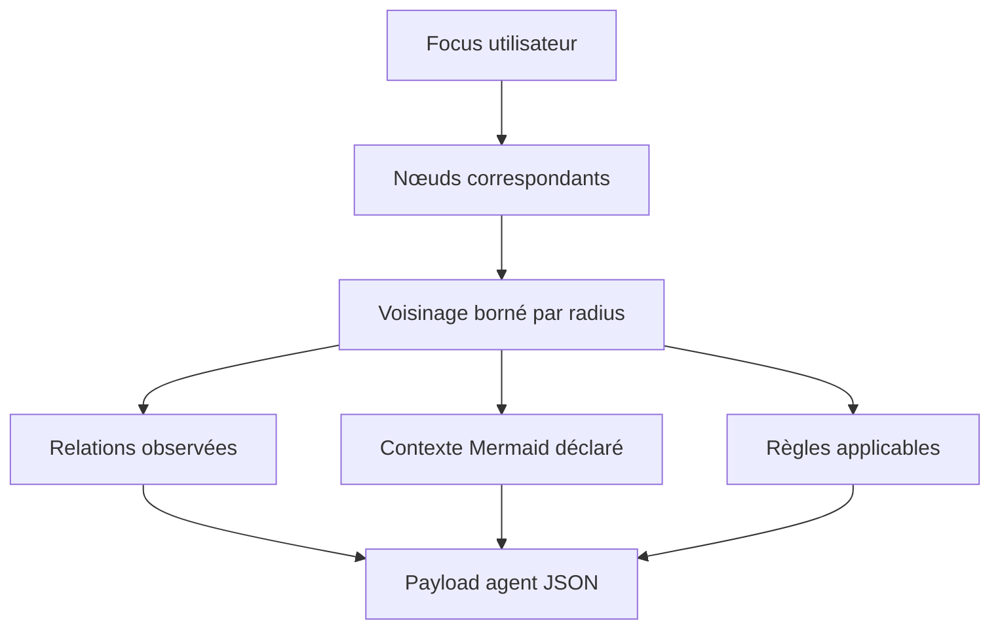
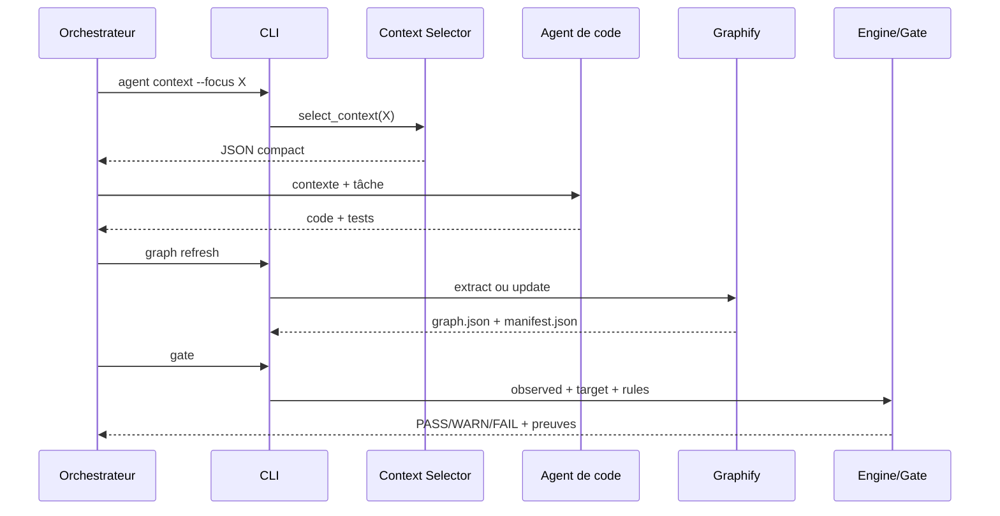

# Documentation technique

Ce document décrit l’architecture interne d’Architecture Harness V2.2, les interactions entre couches et toutes les commandes de la CLI. Les exemples supposent que `arch-harness` est disponible dans le `PATH`. Depuis le dépôt du Harness, utilisez au besoin `.venv/bin/arch-harness`.

## 1. Vue d’ensemble des couches



| Couche | Répertoire ou module | Responsabilité |
|---|---|---|
| Entrée | `cli.py` | parse les arguments, orchestre les appels et fixe les codes de sortie |
| Configuration | `config.py` | résout les chemins conventionnels du projet |
| Adaptateurs | `adapters/` | convertit Mermaid, Graphify et YAML en modèles internes |
| IR | `ir/` | modèles typés pour graphes, contexte, règles et provenance |
| Moteur | `engine/` | matching des rôles, chemins, sélection de contexte et évaluation |
| Export | `exporters/` | sorties texte, Markdown et JSON stables |
| Runtime | `runtime/mermaid_bridge.mjs`, `graphify_runtime.py` | exécute les parseurs externes et contrôle leurs erreurs |
| Intégrations | `integrations.py`, `integrations/` | installe les instructions propres aux orchestrateurs |
| Cache/métriques | `cache/`, `metrics/` | cache local et mesure de réduction de contexte |

Le sens des dépendances reste CLI → adaptateurs/moteur/exporters. Le moteur ne doit pas dépendre de la CLI. La décision du gate est déterministe et ne contient aucun appel LLM.

## 2. Résolution des chemins

Pour une racine `--root /projets/orders`, `ProjectPaths` résout :

```text
/projets/orders/architecture/diagrams/
/projets/orders/architecture/rules/rules.yaml
/projets/orders/contexte/
/projets/orders/graphify-out/graph.json
```

`--root` est donc la racine du projet analysé, pas celle du Harness. Sans `--root`, la CLI utilise le répertoire courant.

## 3. Pipeline Mermaid déclaré

`adapters/mermaid.py` transmet le texte au bridge Node embarqué. Le bridge utilise Mermaid 11.17.2 comme autorité de validation et `@mermaid-js/parser` lorsque son AST est disponible.



Les flowcharts, architectures, classes, séquences, ER et états sont normalisés selon les faits disponibles. Un diagramme valide mais non orienté dépendances conserve son type et son texte ; il n’est pas transformé artificiellement en règle.

## 4. Pipeline Graphify observé

`arch-harness graph refresh` cherche d’abord `PROJECT/.venv/bin/graphify`, puis un exécutable système. Sans manifeste, il exécute une extraction complète ; avec un manifeste, une mise à jour incrémentale.

```text
premier passage : graphify extract <root> --code-only --no-cluster
passages suivants : graphify update <root> --no-cluster
```

Le résultat est converti en `ObservedGraphIR` : nœuds, fichiers, types, arêtes, relation, provenance et confiance. `manifest.json` relie le graphe aux empreintes des sources. Le gate refuse un graphe périmé afin de ne jamais valider une ancienne version du code.

## 5. Pipeline des règles

`adapters/rules.py` charge les rôles et les contraintes YAML. Le moteur suit ensuite ce flux :



Les recherches de chemin produisent le plus court chemin comme preuve. Une violation n’est bloquante que pour une règle `status: validated` et `severity: error`.

## 6. Construction du contexte compact

`engine/context_selector.py` reçoit un ou plusieurs focus, un rayon et une limite. Il sélectionne le voisinage observé, projette les faits déclarés et les règles pertinentes, puis retourne les fichiers utiles et une métrique de tokens.



Cette étape évite d’envoyer l’intégralité de `graphify-out/graph.json` à l’agent.

## 7. Gate et codes de sortie

Le gate vérifie d’abord la fraîcheur, charge les trois IR, appelle `evaluate`, puis construit un payload immuable.

| Code | Sens technique | Traitement attendu |
|---:|---|---|
| 0 | PASS, WARN ou NOT_APPLICABLE | continuer en conservant les advisories |
| 1 | violation bloquante | corriger le code, refresh, relancer |
| 2 | graphe périmé, mapping `required` non résolu ou erreur technique | lancer `doctor`, réparer la configuration |

## 8. Référence complète des commandes

### Convention commune

```bash
arch-harness [--root CHEMIN] COMMANDE
```

Exemple hors du projet courant :

```bash
arch-harness --root /projets/orders doctor
```

### `graph refresh`

```bash
arch-harness graph refresh --format json
```

Rafraîchit l’architecture observée, écrit `graph.json` et `manifest.json`, puis vérifie immédiatement leur fraîcheur. La réponse indique `mode` (`extract` ou `update`), commande Graphify, résumé et durée. À exécuter après une modification cohérente du code, avant le gate.

### `stale`

```bash
arch-harness stale
```

Compare les sources actuelles au manifeste sans modifier le graphe. Exemple de sortie :

```text
fresh: false
stale: src/orders/service.py
```

Utile dans un script CI qui veut distinguer « graphe périmé » de « règle violée ».

### `observed`

```bash
arch-harness observed
```

Résume le graphe Graphify sans évaluer de règle : nombre de nœuds, arêtes et niveaux de confiance. Exemple :

```text
nodes: 120
edges: 245
extracted: 230
inferred: 15
ambiguous: 0
```

### `target`

```bash
arch-harness target
```

Parse tous les Mermaid de `architecture/diagrams/` et affiche nœuds, arêtes et sous-graphes normalisés. À utiliser pour diagnostiquer un diagramme rejeté ou vérifier ses identifiants.

### `context overview`

```bash
arch-harness context overview
```

Résume les Mermaid de `contexte/` : nœuds, relations et provenance `DECLARED_CONTEXT`. Cette commande n’analyse pas le code.

### `context build`

```bash
arch-harness context build --focus OrderController --radius 1 --max-items 50
```

Construit une version texte du contexte compact pour lecture humaine. `--focus` est répétable, `--radius` définit la profondeur du voisinage et `--max-items` borne la réponse.

Exemple avec deux zones :

```bash
arch-harness context build --focus OrderController --focus PaymentService --radius 2
```

### `rules validate`

```bash
arch-harness rules validate
arch-harness rules validate --file architecture/rules/candidates.yaml
```

Valide la structure YAML, les rôles, types, statuts, provenances et applicabilités. Sans `--file`, cible `rules.yaml`. La commande ne promeut et n’évalue aucune règle.

Exemple de sortie :

```text
valid: 3 rules, 4 roles
```

### `rules list`

```bash
arch-harness rules list
```

Liste les règles validées sous forme courte. Exemple :

```text
controller-must-use-service: required_edge Controller -> Service
```

### `rules author-context`

```bash
arch-harness rules author-context --format json
```

Prépare l’entrée du skill `architecture-rule-author` : types Mermaid, sources complètes, faits déclarés et propositions de mapping Graphify classées. La commande est en lecture seule et n’écrit aucune candidate.

Extrait simplifié :

```json
{
  "status": "PASS",
  "mapping_proposals": [
    {
      "declared_id": "Controller",
      "status": "resolved_candidate",
      "candidates": [
        {
          "graphify_id": "src_orders_controller_ordercontroller",
          "file": "src/orders/controller.py"
        }
      ]
    }
  ]
}
```

### `check`

```bash
arch-harness check --format text
arch-harness check --format json
arch-harness check --format markdown
```

Évalue directement l’architecture et permet trois formats de rapport. Contrairement à `gate`, cette commande ne vérifie pas préalablement le manifeste de fraîcheur. Préférez `gate` dans les workflows automatisés.

### `gate`

```bash
arch-harness gate --format json
```

Checkpoint sûr : refuse un graphe périmé, évalue les règles et retourne un JSON destiné à la CI ou à un orchestrateur. Exemple de boucle shell :

```bash
arch-harness graph refresh --format json && arch-harness gate --format json
```

### `doctor`

```bash
arch-harness doctor
```

Diagnostique les entrées, Mermaid, graphe, règles et cache. À lancer après un code de sortie 2. Chaque contrôle est affiché avec `PASS` ou `FAIL`.

### `capabilities`

```bash
arch-harness capabilities --format json
```

Décrit le contrat machine-readable : commandes, formats, statuts et codes de sortie. Un nouvel orchestrateur doit découvrir l’API par cette commande au lieu de supposer ses capacités.

### `agent context`

```bash
arch-harness agent context --focus OrderService --radius 1 --max-items 50 --format json
```

Version JSON stable de `context build`, destinée aux agents. Retourne `observed_code`, `declared_context`, `target_architecture`, `applicable_rules`, `relevant_files`, provenance et métriques.

### `agent validate`

```bash
arch-harness agent validate --format json
```

Vérifie la fraîcheur puis évalue l’architecture avec un contrat JSON stable. C’est l’équivalent agent du checkpoint final. Code 1 pour les violations, code 2 pour un problème technique ou un `UNRESOLVED` obligatoire.

### `agent doctor`

```bash
arch-harness agent doctor --format json
```

Version JSON de `doctor`, conçue pour permettre à un agent de diagnostiquer un code 2 sans parser du texte humain.

### `agent capabilities`

```bash
arch-harness agent capabilities --format json
```

Expose le même contrat stable que `capabilities` dans l’espace de commandes réservé aux agents.

### `integrations install`

```bash
arch-harness --root /projets/orders integrations install codex --adapter-root /opt/architecture-harness
arch-harness --root /projets/orders integrations install claude --adapter-root /opt/architecture-harness
arch-harness --root /projets/orders integrations install bmad --adapter-root /opt/architecture-harness
```

Copie les skills et instructions de l’orchestrateur. Les valeurs acceptées sont `codex`, `claude` et `bmad`. L’installateur refuse d’écraser les assets existants ; `--force` ne doit être utilisé qu’après comparaison et sauvegarde.

### `benchmark`

```bash
arch-harness benchmark --mode v2 --tasks experiments/tasks.yaml
```

Mesure la réduction de tokens obtenue par le contexte compact sur un corpus de tâches. Modes : `v1`, `v1.1`, `v2`. Cette commande sert à la métrologie, pas au gate de production.

### `ace compile` et `ace validate` — expérimental

```bash
arch-harness ace compile --text "Controller must not call Repository"
arch-harness ace validate architecture/rules/candidates.yaml
```

`compile` transforme une phrase contrôlée en proposition structurée. `validate` utilise l’adaptateur APE expérimental. Ces commandes ne remplacent ni le Rule Author ni la validation humaine.

## 9. Séquence technique complète



## 10. CI recommandée

```bash
set -e
arch-harness doctor
arch-harness graph refresh --format json
arch-harness gate --format json
pytest
```

Dans ce dépôt, la validation complète du Harness lui-même est :

```bash
scripts/validate_v1_1.sh
scripts/validate_v2.sh
```

`scripts/validate_v2.sh` couvre notamment Graphify, fraîcheur, tests, gate, capacités, benchmark, Test Lab, skills et overrides BMAD.

## 11. Limites techniques

- Les matchers de rôles sont explicites et lexicaux ; vérifiez leur résolution avant de bloquer.
- `scope` et `exceptions` sont conservés dans l’IR mais n’ont pas encore une sémantique universelle active.
- Toutes les familles Mermaid ne représentent pas des dépendances de code.
- Graphify est l’autorité d’extraction ; le Harness ne réimplémente pas son analyse.
- Un gate PASS ne couvre ni logique métier, ni sécurité, ni performance.
