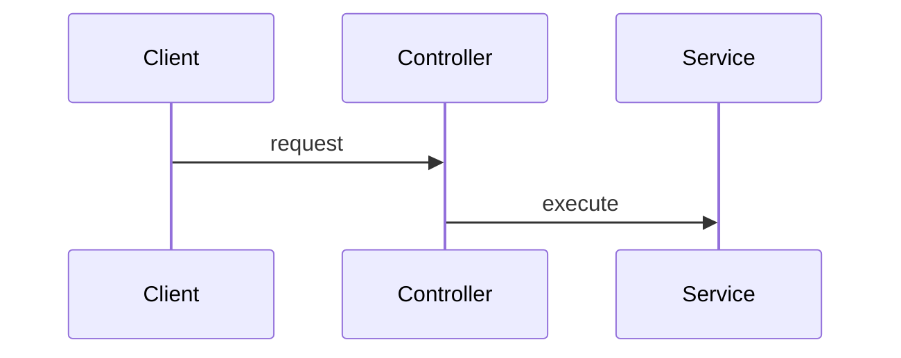

# Installer et tester Architecture Harness V2.2

Ce guide installe Architecture Harness dans un autre projet et vérifie sa boucle Mermaid → skill LLM → mappings Graphify → règles candidates → validation humaine → gate déterministe. Les exemples utilisent `/opt/architecture-harness` pour le dépôt du Harness et `/tmp/demo-architecture` pour le projet cible ; remplacez-les par vos chemins.

## 1. Prérequis communs

- Git ;
- Python 3.10 ou plus récent ;
- Node.js 20 ou plus récent et npm ;
- `uv` pour les workflows Build de BMAD 6.11 ;
- un orchestrateur : BMAD/Codex, Codex seul ou Claude Code.

Installer le Harness et son runtime Mermaid officiel :

```bash
git clone <URL_DU_DEPOT_HARNESS> /opt/architecture-harness
cd /opt/architecture-harness
npm ci
python3 -m venv .venv
.venv/bin/python -m pip install -e '.[dev]'
scripts/validate_v2.sh
```

`npm ci` installe `mermaid` officiel et `@mermaid-js/parser`. L’ancien parseur Python à expressions régulières n’est plus utilisé. Le parser officiel valide le diagramme, identifie son type et expose les faits structurels disponibles. Le skill reçoit aussi le texte Mermaid intégral pour conserver les faits des familles sans graphe de dépendances uniforme.

## 2. Créer le projet cible

```bash
mkdir -p /tmp/demo-architecture
cd /tmp/demo-architecture
git init
python3 -m venv .venv
.venv/bin/python -m pip install -e '/opt/architecture-harness[dev]'
export PATH="$PWD/.venv/bin:$PATH"
python -m pip install uv
mkdir -p architecture/diagrams architecture/rules contexte
```

Créer `architecture/diagrams/target.mmd` :


Créer `architecture/rules/rules.yaml` :

```yaml
roles: {}
rules: []
```

Créer `architecture/rules/candidates.yaml` avec le même contenu et `architecture/rules/decisions.md` :

```markdown
# Architecture decisions

No rule promoted yet.
```

Créer au moins un Mermaid de contexte, par exemple `contexte/runtime.mmd` :



Avant le premier code greenfield, vérifier le parser et le contexte d’authoring :

```bash
arch-harness --root "$PWD" target
arch-harness --root "$PWD" rules author-context --format json
```

Les mappings doivent être `pending_code`, car Graphify n’a encore aucun code à observer. Le skill doit les conserver avec `applicability: when_observed`, pas demander des identifiants manuels.

## 3. Utilisation avec BMAD

Installer BMAD 6.11 et l’adaptateur :

```bash
npx bmad-method install --modules bmm --tools codex
arch-harness --root "$PWD" integrations install bmad \
  --adapter-root /opt/architecture-harness
```

Vérifier :

```bash
find _bmad/custom -maxdepth 1 -type f -print
find .agents/skills/architecture-rule-author -type f -print
```

L’installation doit fournir trois overrides BMAD et le skill réellement appelable. Dans l’orchestrateur, lancer `$bmad-architecture`. Après création ou modification du Mermaid, BMAD doit automatiquement invoquer `$architecture-rule-author`, lequel exécute :

```bash
arch-harness rules author-context --format json
```

Il doit écrire des candidates, conserver les mappings greenfield en attente et ne demander que la signification incertaine des relations. Approuver ensuite la spécification BMAD et lancer `$bmad-build`.

Après le premier code, BMAD doit exécuter automatiquement :

```bash
arch-harness graph refresh --format json
arch-harness rules author-context --format json
```

Le second `author-context` classe les nœuds Graphify possibles. Le skill choisit automatiquement une correspondance suffisamment étayée par l’identifiant, le fichier, le type du symbole et le Mermaid. Il ne sollicite l’humain que si plusieurs interprétations restent plausibles.

Examiner `architecture/rules/candidates.yaml`. Une candidate typique reste non bloquante :

```yaml
roles:
  Controller:
    match:
      exact: src_controller_ordercontroller
rules:
  - id: controller-must-use-service
    type: required_edge
    source: Controller
    target: Service
    severity: warning
    provenance: GENERATED
    status: candidate
    applicability: when_observed
```

Après revue humaine, déplacer uniquement les règles approuvées dans `rules.yaml`, utiliser `status: validated`, `provenance: USER_CONFIRMED`, choisir l’applicabilité, puis tracer la décision dans `decisions.md`.

Terminer par :

```bash
arch-harness graph refresh --format json
arch-harness doctor
arch-harness gate --format json
```

Lancer enfin `$bmad-code-review`. La revue fonctionnelle reste obligatoire : un gate architectural PASS ne prouve pas le comportement métier.

## 4. Utilisation avec Codex sans BMAD

Installer l’intégration :

```bash
arch-harness --root "$PWD" integrations install codex \
  --adapter-root /opt/architecture-harness
```

Cette commande installe `.agents/skills/architecture-rule-author/` et ajoute un bloc géré dans `AGENTS.md`. Demander ensuite à Codex de créer ou modifier l’architecture. Les instructions du projet lui imposent d’appeler automatiquement le skill après un changement Mermaid, après le premier graphe greenfield et lors d’un mapping non résolu.

Pour tester explicitement le déclenchement :

```text
Modifie architecture/diagrams/target.mmd pour ajouter PaymentService, puis applique le workflow architectural du projet.
```

Codex doit utiliser `$architecture-rule-author`, générer des candidates, rafraîchir Graphify après le code, résoudre les mappings étayés puis exécuter le gate. Il ne doit jamais promouvoir une règle sans approbation.

## 5. Utilisation avec Claude Code

Installer l’intégration :

```bash
arch-harness --root "$PWD" integrations install claude \
  --adapter-root /opt/architecture-harness
```

Cette commande installe :

```text
.claude/skills/architecture-harness/
.claude/skills/architecture-rule-author/
CLAUDE.md
```

Dans Claude Code, demander une évolution du Mermaid ou du code. `CLAUDE.md` impose le déclenchement automatique du Rule Author aux mêmes checkpoints. Pour un appel manuel de diagnostic, utiliser `/architecture-rule-author`, mais l’utilisateur ne devrait pas avoir à l’invoquer pendant le workflow normal.

## 6. Test manuel des quatre résultats du gate

Après promotion d’une règle validée :

```bash
arch-harness graph refresh --format json
arch-harness gate --format json
echo $?
```

Vérifier successivement :

| Cas | Configuration | Résultat/code |
|---|---|---|
| relation respectée | mapping présent et code conforme | `PASS` / 0 |
| relation violée | mapping présent et code contraire | `FAIL` / 1 |
| mapping obligatoire absent | `applicability: required` | `UNRESOLVED` / 2 |
| composant futur absent | `applicability: when_observed` | `NOT_APPLICABLE` / 0 |

## 7. Diagnostic

- Parser indisponible : exécuter `npm ci` dans le dépôt Harness et vérifier `node --version`.
- Graphe périmé : exécuter `arch-harness graph refresh --format json`.
- Mapping ambigu : examiner `mapping_proposals` et les fichiers Graphify ; demander une décision seulement si la sémantique reste réellement ambiguë.
- Override ou skill déjà présent : l’installateur refuse l’écrasement. Comparer les fichiers, puis utiliser `--force` uniquement après revue.
- Mise à jour BMAD ou Mermaid : réinstaller les dépendances, réappliquer l’adaptateur dans un projet de test et relancer le parcours complet avant mise à niveau du projet réel.
