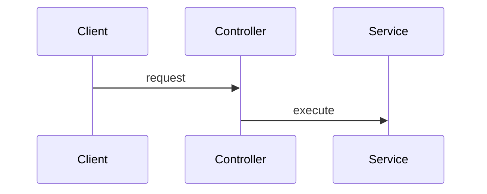
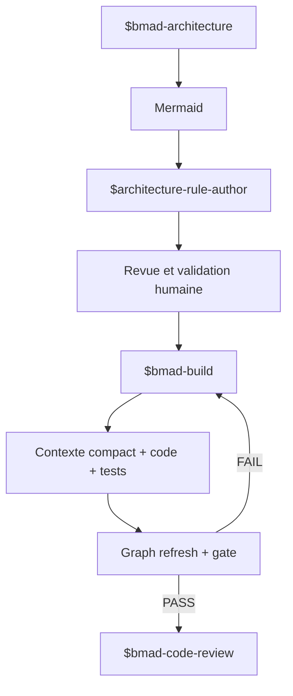

# Installation avec Claude Code, BMAD, Codex ou GitHub Copilot

Ce guide part d’une machine neuve et distingue deux emplacements :

- `/opt/architecture-harness` : clone du produit Architecture Harness ;
- `/projets/mon-app` : projet que vous voulez protéger.

Remplacez ces chemins par les vôtres. Les commandes macOS/Linux utilisent un environnement virtuel Python local.

## 1. Prérequis

- Git ;
- Python 3.10 ou plus récent ;
- Node.js 20 ou plus récent et npm ;
- l’orchestrateur choisi ;
- `uv` en plus pour BMAD 6.11.

Vérification :

```bash
git --version
python3 --version
node --version
npm --version
```

## 2. Installer Architecture Harness

```bash
git clone <URL_DU_DEPOT> /opt/architecture-harness
cd /opt/architecture-harness
python3 -m venv .venv
.venv/bin/python -m pip install --upgrade pip
.venv/bin/python -m pip install -e '.[dev]'
npm ci
.venv/bin/arch-harness doctor
```

Pourquoi ces commandes :

| Commande | Utilité |
|---|---|
| `python3 -m venv .venv` | isole Python et la CLI du système |
| `pip install -e '.[dev]'` | installe `arch-harness`, Graphify et les outils de validation |
| `npm ci` | installe le parseur Mermaid officiel dans ses versions verrouillées |
| `arch-harness doctor` | vérifie l’installation et les fichiers attendus |

Pour valider le dépôt du Harness lui-même :

```bash
cd /opt/architecture-harness
scripts/validate_v2.sh
```

## 3. Préparer le projet cible

```bash
cd /projets/mon-app
python3 -m venv .venv
.venv/bin/python -m pip install -e '/opt/architecture-harness[dev]'
export PATH="$PWD/.venv/bin:$PATH"
mkdir -p architecture/diagrams architecture/rules contexte
```

Créez `architecture/diagrams/target.mmd` :


Créez `architecture/rules/rules.yaml` et `architecture/rules/candidates.yaml` :

```yaml
roles: {}
rules: []
```

Créez `architecture/rules/decisions.md` :

```markdown
# Décisions d’architecture

Aucune règle promue pour le moment.
```

Créez `contexte/runtime.mmd` :



Vérifiez la base :

```bash
arch-harness --root "$PWD" target
arch-harness --root "$PWD" rules validate
arch-harness --root "$PWD" rules author-context --format json
```

Dans un projet greenfield sans code, l’état `pending_code` est normal.

## 4. Installer avec Codex

### Étape 1 — installer l’adaptateur

Depuis le projet cible :

```bash
arch-harness --root "$PWD" integrations install codex \
  --adapter-root /opt/architecture-harness
```

Cette commande :

- copie le skill dans `.agents/skills/architecture-rule-author/` ;
- ajoute un bloc géré à `AGENTS.md` ;
- conserve le cœur indépendant de Codex.

### Étape 2 — vérifier les fichiers

```bash
find .agents/skills/architecture-rule-author -type f -print
rg -n "Architecture Harness" AGENTS.md
```

### Étape 3 — tester dans Codex

Demande d’essai :

```text
Lis le contexte Architecture Harness pour OrderService, ajoute une petite évolution,
exécute les tests, rafraîchis le graphe et valide l’architecture.
```

Codex doit exécuter :

```bash
arch-harness agent context --focus OrderService --format json
# modification et tests
arch-harness graph refresh --format json
arch-harness agent validate --format json
```

Après un changement Mermaid, il doit utiliser automatiquement `$architecture-rule-author`.

## 5. Installer avec Claude Code

### Étape 1 — installer l’adaptateur

```bash
arch-harness --root "$PWD" integrations install claude \
  --adapter-root /opt/architecture-harness
```

Cette commande installe :

```text
.claude/skills/architecture-harness/
.claude/skills/architecture-rule-author/
CLAUDE.md
```

### Étape 2 — vérifier les fichiers

```bash
find .claude/skills -maxdepth 3 -type f -print
rg -n "Architecture Harness" CLAUDE.md
```

### Étape 3 — tester dans Claude Code

Demande d’essai :

```text
Implémente cette évolution en respectant Architecture Harness. Utilise le contexte
compact avant le code et le gate après les tests.
```

Le skill `/architecture-harness` impose le cycle contexte → code/tests → refresh → gate. Après un changement Mermaid ou un mapping non résolu, `/architecture-rule-author` prépare les candidates. La promotion reste soumise à votre approbation explicite.

## 6. Installer avec BMAD

Le terme « BMAD » désigne ici BMAD Method 6.11 ou plus récent.

### Étape 1 — installer BMAD et `uv`

```bash
cd /projets/mon-app
npx bmad-method install --modules bmm --tools codex
python3 -m pip install uv
```

`uv` est requis par les workflows Build de BMAD 6.11.

### Étape 2 — installer l’adaptateur Harness

```bash
arch-harness --root "$PWD" integrations install bmad \
  --adapter-root /opt/architecture-harness
```

L’installateur vérifie que `_bmad/` existe, puis copie :

```text
_bmad/custom/bmad-architecture.toml
_bmad/custom/bmad-build.toml
_bmad/custom/bmad-code-review.toml
.agents/skills/architecture-rule-author/
```

### Étape 3 — vérifier

```bash
find _bmad/custom -maxdepth 1 -type f -print
find .agents/skills/architecture-rule-author -type f -print
arch-harness doctor
```

### Étape 4 — utiliser le workflow



Ordre recommandé :

1. lancez `$bmad-architecture` pour concevoir ou mettre à jour Mermaid ;
2. laissez `$architecture-rule-author` créer les candidates ;
3. révisez et approuvez explicitement les règles souhaitées ;
4. lancez `$bmad-build` pour implémenter ;
5. laissez le workflow boucler sur Graphify et le gate ;
6. terminez par `$bmad-code-review`.

Après le premier code greenfield, BMAD relance `graph refresh` puis `rules author-context` pour résoudre les mappings qui étaient `pending_code`.

## 7. Installer avec GitHub Copilot

Architecture Harness V2.2 n’expose pas encore de commande `integrations install copilot`. Copilot utilise donc l’intégration générique : une instruction de dépôt appelle la même CLI stable. Cette méthode ne nécessite aucun SDK.

### Étape 1 — créer les instructions Copilot

Créez `.github/copilot-instructions.md` avec ce contenu :

```markdown
# Architecture Harness

Avant toute modification significative, exécuter :

`arch-harness agent context --focus <noeud-pertinent> --format json`

Après les tests et à chaque checkpoint cohérent, exécuter :

`arch-harness graph refresh --format json`

`arch-harness gate --format json`

Un code 1 impose de corriger toutes les violations bloquantes puis de répéter refresh
et gate. Un code 2 impose `arch-harness agent doctor --format json`. Ne jamais modifier
une règle validée uniquement pour obtenir PASS.

Après une modification Mermaid, un premier graphe greenfield ou un mapping non résolu,
lire `skills/architecture-rule-author/SKILL.md`, exécuter
`arch-harness rules author-context --format json`, puis écrire uniquement des candidates
non bloquantes sans promotion non approuvée.
```

### Étape 2 — rendre le skill accessible

Copiez le skill versionné dans le projet :

```bash
mkdir -p skills/architecture-rule-author
cp /opt/architecture-harness/skills/architecture-rule-author/SKILL.md \
  skills/architecture-rule-author/SKILL.md
```

### Étape 3 — tester dans Copilot Chat

Demande d’essai :

```text
Avant de modifier OrderService, lis .github/copilot-instructions.md et récupère le
contexte compact Architecture Harness. Après les tests, rafraîchis le graphe et lance le gate.
```

Vérifiez dans le terminal que Copilot a bien exécuté :

```bash
arch-harness agent context --focus OrderService --format json
arch-harness graph refresh --format json
arch-harness gate --format json
```

Si votre édition de Copilot n’autorise pas l’exécution de commandes, lancez ces commandes vous-même et fournissez la sortie JSON au chat.

## 8. Premier cycle commun

Quel que soit l’orchestrateur :

```bash
# 1. vérifier la configuration
arch-harness doctor

# 2. obtenir le contexte avant le code
arch-harness agent context --focus OrderService --format json

# 3. après le code et les tests
arch-harness graph refresh --format json

# 4. contrôler l’architecture
arch-harness gate --format json
echo $?
```

Interprétation :

| Code | Résultat | Action |
|---:|---|---|
| 0 | PASS, WARN ou NOT_APPLICABLE | examiner les advisories puis continuer |
| 1 | violation architecturale bloquante | corriger le code et répéter les étapes 3–4 |
| 2 | problème technique/configuration | exécuter `arch-harness agent doctor --format json` |

## 9. Mettre à jour une intégration

Les installateurs refusent d’écraser un asset existant. Procédure sûre :

1. mettez à jour `/opt/architecture-harness` ;
2. comparez vos fichiers installés aux nouvelles versions ;
3. sauvegardez ou committez vos personnalisations ;
4. utilisez `--force` seulement après revue.

Exemple :

```bash
git -C /opt/architecture-harness pull
arch-harness --root /projets/mon-app integrations install codex \
  --adapter-root /opt/architecture-harness --force
```

## 10. Résolution des problèmes

### `arch-harness: command not found`

```bash
export PATH="/projets/mon-app/.venv/bin:$PATH"
# ou utilisez explicitement
/projets/mon-app/.venv/bin/arch-harness doctor
```

### `Graphify executable not found`

Installez les dépendances de développement dans l’environnement virtuel du projet :

```bash
.venv/bin/python -m pip install -e '/opt/architecture-harness[dev]'
```

### Mermaid ou runtime Node indisponible

```bash
cd /opt/architecture-harness
npm ci
node --version
```

### `STALE_GRAPH`

```bash
arch-harness graph refresh --format json
arch-harness gate --format json
```

### Mapping ambigu ou obligatoire absent

```bash
arch-harness rules author-context --format json
```

Examinez `mapping_proposals`. Le skill peut accepter un candidat clairement étayé ; demandez une décision humaine si plusieurs significations restent plausibles.

### L’installateur refuse un écrasement

Comparez les fichiers et conservez vos personnalisations. N’utilisez `--force` qu’après cette revue.

## 11. Test de recette minimal

Une installation est opérationnelle si les commandes suivantes réussissent :

```bash
arch-harness doctor
arch-harness target
arch-harness rules validate
arch-harness graph refresh --format json
arch-harness agent context --focus <NOEUD_REEL> --format json
arch-harness gate --format json
```

Le focus doit correspondre à un nœud déclaré ou observé. Sur un projet sans code, créez d’abord un fichier source significatif, puis relancez `graph refresh`.
