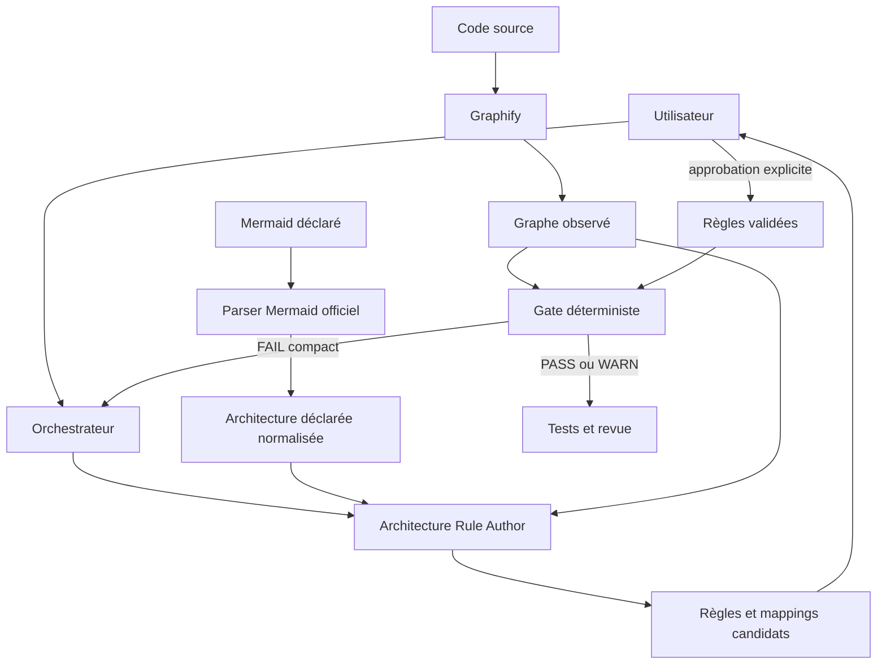
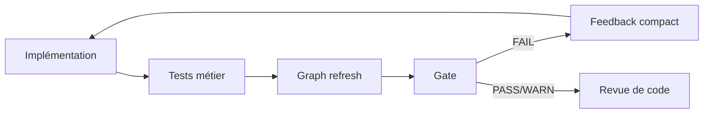

# Workflow et architecture technique d’Architecture Harness V2.2

## 1. Rôle du logiciel

Architecture Harness est un module de guidage et de contrôle architectural destiné aux agents de développement. Il ne produit pas lui-même le code métier. Il relie quatre sources distinctes :

1. l’architecture souhaitée, écrite en Mermaid ;
2. les règles candidates ou validées, écrites en YAML ;
3. l’architecture réellement extraite du code par Graphify ;
4. un orchestrateur tel que BMAD, Codex ou Claude Code.

Le LLM intervient pour comprendre l’intention, proposer les mappings et rédiger des règles candidates. La décision finale du gate reste déterministe : aucun LLM ne décide si une règle validée passe ou échoue.



## 2. Organisation d’un projet consommateur

Le Harness attend conventionnellement :

```text
projet/
├── architecture/
│   ├── diagrams/
│   │   └── *.mmd
│   └── rules/
│       ├── rules.yaml
│       ├── candidates.yaml
│       └── decisions.md
├── contexte/
│   └── *.mmd
├── graphify-out/
│   ├── graph.json
│   └── manifest.json
└── code source et tests
```

Les chemins sont centralisés dans `ProjectPaths` :

- `architecture/diagrams/` : architecture cible ;
- `architecture/rules/rules.yaml` : politique validée ;
- `contexte/` : runtime, sécurité, déploiement ou autres faits déclarés ;
- `graphify-out/graph.json` : graphe observé ;
- `graphify-out/manifest.json` : preuve de fraîcheur.

## 3. Parsing Mermaid officiel

### 3.1 Runtime

Le module Python `adapters/mermaid.py` ne contient plus de parseur Mermaid artisanal. Il lance Node.js et le bridge embarqué :

```text
src/architecture_harness/runtime/mermaid_bridge.mjs
```

Le bridge utilise :

- `mermaid` 11.17.2 comme autorité de validation et de détection du type ;
- `@mermaid-js/parser` pour les familles disposant d’un AST Langium officiel ;
- `jsdom` pour fournir l’environnement DOM nécessaire au parser Mermaid sous Node.js.

Le flux technique est :

```text
texte Mermaid
→ JSON sur stdin
→ Node.js
→ mermaid.parse()
→ modèle officiel du diagramme
→ normalisation JSON
→ TargetArchitectureIR Python
```

### 3.2 Normalisation

Le bridge normalise les structures orientées graphe connues :

- flowcharts : sommets, liens et sous-graphes ;
- `architecture-beta` : services, groupes, jonctions et liens ;
- diagrammes de classes : classes et relations ;
- diagrammes de séquence : participants et messages ;
- diagrammes ER : entités et relations ;
- diagrammes d’état : états et transitions.

Une famille Mermaid valide mais non orientée dépendances, par exemple un diagramme circulaire, n’est pas transformée artificiellement en relation de code. Son type et son texte intégral sont néanmoins conservés dans le contexte du Rule Author. Le skill peut en extraire une guidance `declared_only` ou une justification, sans inventer une règle bloquante.

Le résultat Python est un `TargetArchitectureIR` :

```text
nodes          identifiant Mermaid → libellé
edges          relations déclarées
subgraphs      regroupements déclarés
sources        fichiers Mermaid d’origine
diagram_types  types reconnus par Mermaid officiel
```

## 4. Graphe observé avec Graphify

Graphify 0.9.50 analyse le vrai projet :

```bash
arch-harness graph refresh --format json
```

Au premier passage, le Harness utilise une extraction de code. Aux passages suivants, il utilise une mise à jour incrémentale. Le résultat est converti en `ObservedGraphIR` :

```text
nodes : id, kind, fichier
edges : source, cible, relation, provenance, confiance
```

Le Harness ne réimplémente pas l’analyse syntaxique du code. Graphify reste responsable de l’extraction.

Le manifeste associe les sorties Graphify aux fichiers sources. Le gate vérifie ce manifeste avant l’évaluation et refuse un graphe périmé.

## 5. Génération automatique du contexte d’authoring

La commande centrale est :

```bash
arch-harness rules author-context --format json
```

Elle charge :

- tous les Mermaid de `architecture/diagrams/` ;
- le graphe Graphify s’il existe ;
- les nœuds, relations, sous-graphes et types déclarés ;
- le texte complet de chaque diagramme.

Pour chaque composant déclaré, `rule_author_context.py` :

1. découpe l’identifiant et le libellé Mermaid en termes ;
2. compare ces termes aux identifiants et fichiers Graphify ;
3. privilégie les symboles du code de production ;
4. favorise les suffixes correspondant exactement au composant ;
5. classe les cinq meilleurs candidats ;
6. attribue un état de mapping.

États possibles :

- `resolved_candidate` : un candidat se détache suffisamment ;
- `ambiguous` : plusieurs correspondances restent plausibles ;
- `pending_code` : aucun code observable n’existe encore.

Cette étape ne modifie aucun fichier. Elle prépare une preuve structurée pour le LLM.

## 6. Architecture Rule Author

Le skill installé est :

```text
architecture-rule-author
```

Son entrée obligatoire est la sortie de `rules author-context`. Il doit :

1. traiter chaque Mermaid ;
2. conserver les faits déclarés ;
3. vérifier les candidats Graphify proposés ;
4. sélectionner automatiquement un mapping lorsqu’il est étayé ;
5. ne jamais inventer un identifiant Graphify ;
6. produire des règles candidates ;
7. poser une question seulement si l’ambiguïté restante change réellement la politique ;
8. s’arrêter avant promotion sans approbation explicite.

En greenfield, les composants n’existent pas encore dans Graphify. Le skill écrit alors des candidates `when_observed`. Après le premier code et le premier refresh, l’orchestrateur rappelle automatiquement le skill pour compléter les mappings.

## 7. Modèle des règles

Une règle référence deux rôles :

```yaml
roles:
  Controller:
    match:
      exact: src_orders_controller_ordercontroller

  Repository:
    match:
      exact: src_orders_repository_orderrepository

rules:
  - id: controller-must-not-call-repository
    type: forbidden_edge
    source: Controller
    target: Repository
    severity: error
    scope: [src]
    exceptions: []
    rationale: Le contrôleur délègue au service.
    provenance: USER_CONFIRMED
    status: validated
    applicability: required
```

Types exécutables :

- `required_edge` : relation directe obligatoire ;
- `forbidden_edge` : relation directe interdite ;
- `required_path` : chemin direct ou indirect obligatoire ;
- `forbidden_path` : chemin direct ou indirect interdit.

Le choix `edge`/`path` est important. `forbidden_path Controller → Repository` interdit aussi `Controller → Service → Repository`, tandis que `forbidden_edge` interdit seulement l’appel direct.

## 8. Lifecycle et sécurité des règles

```text
proposed → clarification → candidate → review → validated
```

La séparation de provenance empêche une interprétation LLM de devenir silencieusement une politique :

- `GENERATED` : produit par un outil ou un agent ;
- `USER_CONFIRMED` : confirmé explicitement ;
- `DECLARED` : présent dans le Mermaid ;
- `OBSERVED` : extrait du code ;
- `INFERRED` : déduit mais non confirmé ;
- `AMBIGUOUS` : preuve insuffisante.

Une candidate demeure dans `candidates.yaml`. Une règle ne devient bloquante que lorsqu’elle est placée dans `rules.yaml` avec :

```yaml
severity: error
status: validated
```

La décision humaine est enregistrée dans `decisions.md`.

## 9. Évaluation déterministe

Le moteur `engine/harness.py` reçoit :

```text
ObservedGraphIR + TargetArchitectureIR + RulesIR
```

Pour chaque règle :

1. le matcher résout les rôles vers des nœuds Graphify ;
2. l’applicabilité traite les mappings absents ;
3. le moteur teste une arête ou recherche un chemin ;
4. une `RuleAssessment` est produite ;
5. une violation est classée bloquante ou advisory.

La recherche de chemin est déterministe et produit le plus court chemin servant de preuve. Aucune inférence LLM n’est appelée dans cette phase.

## 10. Applicabilité

- `required` : source et cible doivent être observables ; sinon `UNRESOLVED` ;
- `when_observed` : la règle attend que le composant existe ; sinon `NOT_APPLICABLE` ;
- `declared_only` : guidance fournie à l’agent, jamais évaluée sur le code.

Cette distinction empêche deux erreurs : considérer un composant futur comme une violation, ou considérer un mapping obligatoire cassé comme un succès.

## 11. Contexte compact avant développement

L’orchestrateur demande :

```bash
arch-harness agent context --focus <nœud> --format json
```

Le sélecteur :

1. trouve les nœuds observés correspondant au focus ;
2. étend un voisinage borné ;
3. sélectionne les relations observées pertinentes ;
4. projette les Mermaid et règles applicables ;
5. retourne seulement les fichiers utiles ;
6. mesure le nombre de tokens.

Cela évite de transmettre tout `graph.json` au LLM.

## 12. Gate et boucle de correction

À un checkpoint significatif :

```bash
arch-harness graph refresh --format json
arch-harness gate --format json
```

Si le gate retourne `FAIL`, l’orchestrateur réinjecte uniquement les violations compactes dans l’agent. L’agent corrige le code sans affaiblir les règles, puis répète refresh et gate.



Un gate `PASS` ne prouve pas le comportement fonctionnel. Les tests et la revue restent obligatoires.

## 13. Intégrations orchestrateurs

### BMAD

L’installateur copie :

```text
_bmad/custom/bmad-architecture.toml
_bmad/custom/bmad-build.toml
_bmad/custom/bmad-code-review.toml
.agents/skills/architecture-rule-author/
```

`bmad-architecture` invoque le Rule Author après un changement Mermaid. `bmad-build` le rappelle après le premier graphe greenfield ou un mapping non résolu. `bmad-code-review` relit le dernier verdict architectural.

### Codex

L’installateur copie le skill dans `.agents/skills/` et ajoute un bloc géré dans `AGENTS.md`. Codex reçoit ainsi les checkpoints et les conditions de déclenchement automatique.

### Claude Code

L’installateur copie les skills dans `.claude/skills/` et ajoute un bloc géré dans `CLAUDE.md`.

Les trois intégrations appellent la même CLI ; le cœur ne dépend d’aucun orchestrateur.

## 14. Validation interne du projet

```bash
scripts/validate_v1.sh
scripts/validate_v2.sh
```

La validation V2 exécute notamment :

- refresh Graphify et fraîcheur ;
- doctor ;
- tests Python ;
- gate de production ;
- contrat de capacités ;
- benchmark de contexte ;
- Test Lab déterministe ;
- validation des skills ;
- parsing des overrides BMAD.

La version 2.2 validée possède 68 tests automatisés. Les résultats restent une preuve sur le corpus testé, pas une garantie universelle de réussite autonome.
